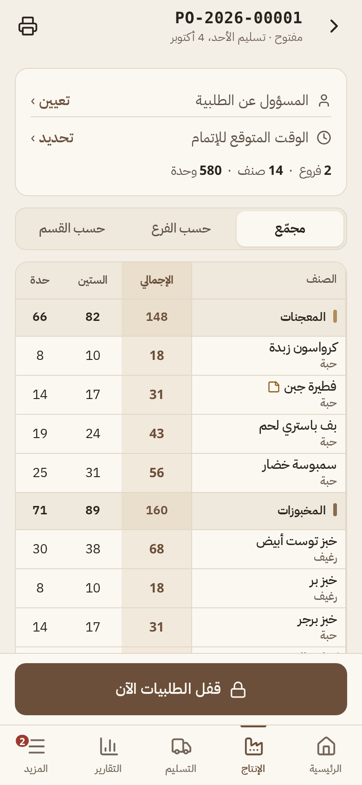
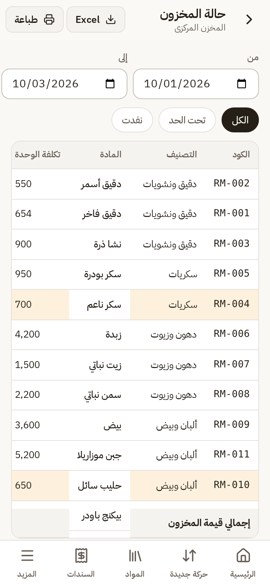
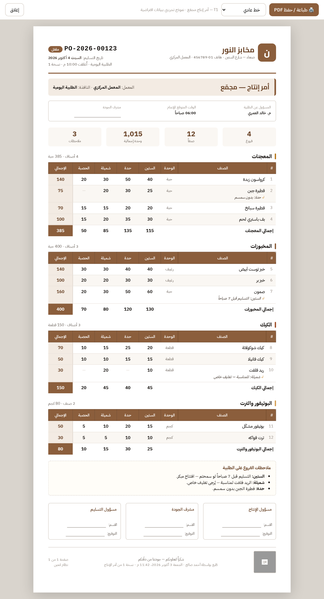
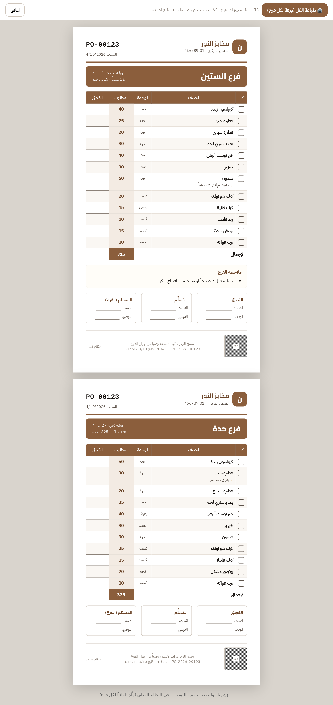
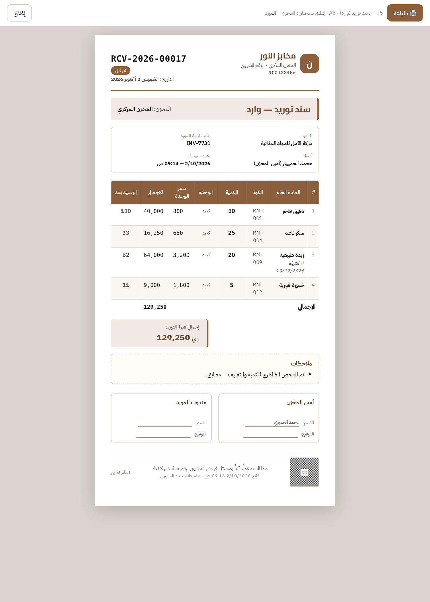
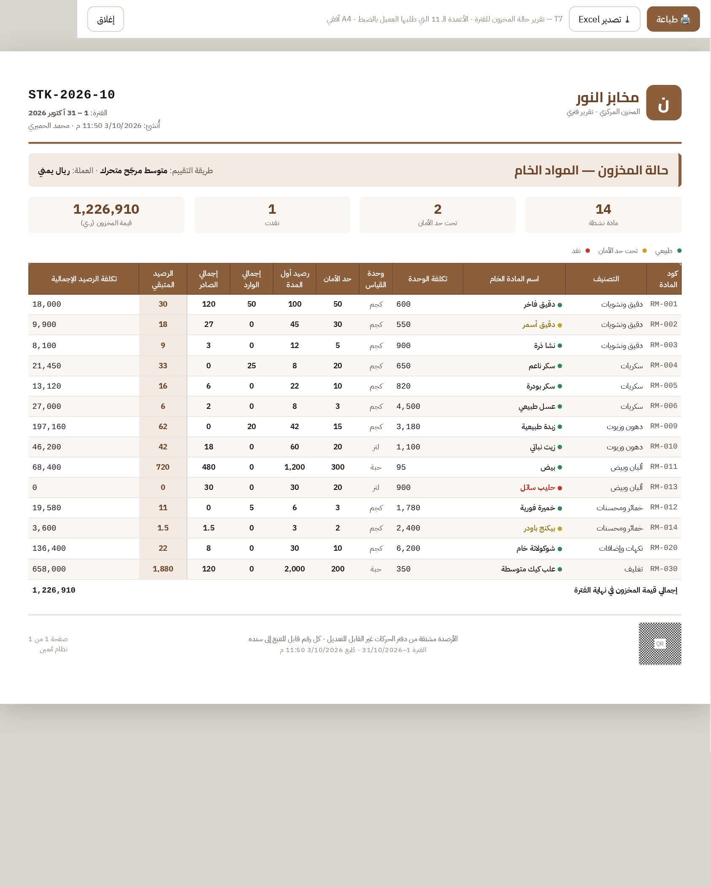

# مُعين (Moain) — نظام الطلبيات والإنتاج والمخزون لمعامل المخابز

> **الحالة:** النسخة الأولى **M0 تعمل** — تطبيق ويب تقدّمي (PWA) عربي يُثبَّت على الجوال والكمبيوتر
> **الموقع المباشر:** انظر قسم [التشغيل المباشر](#-التشغيل-المباشر) أدناه
> **الاختبارات:** 154 اختبار وحدة · 45/45 مسار كامل للواجهة البرمجية · 12/12 قيود قاعدة البيانات · 17/17 عزل المنشآت

مُعين يحوّل طلب العميل («شيت إكسل للطلبيات + قالبي مخزون») إلى نظام تشغيلي واحد:
**طلبيات الفروع اليومية ← أمر إنتاج المعمل المجمّع ← التسليم بتوقيع ← مخزون المواد الخام بدفتر حركات لا يُعدَّل.**

| | |
|---|---|
|  |  |
|  |  |

---

## 🧭 ماذا يفعل كل مستخدم

| الدور | ما يراه | أهم الشاشات |
|---|---|---|
| **مستخدم الفرع** | طلبيته فقط | الرئيسية (عدّاد الإغلاق) · إدخال الطلبية بالأقسام الخمسة (المعجنات/المخبوزات/الكيك/البوتيفورات/الترت) · مراجعة وإرسال · السجل · الاستلام · طلب تعديل بعد الإغلاق |
| **مدير المعمل** | كل الفروع | أوامر الإنتاج · مصفوفة صنف × فرع بالإجماليات · المسؤول والوقت المتوقع · قفل/بدء/إكمال · الاستثناءات · الطباعة · التسليم بتوقيع |
| **موظف المعمل** | الإنتاج والتسليم | نفس شاشات المعمل بدون قرارات الإدارة |
| **أمين المخزن** | المخزون والتكاليف | وارد/صارف سريع · المواد وبطاقة كل مادة · السندات (إلغاء بعكس الحركات) · حالة المخزون (الأعمدة الـ 11) · دفتر الحركة اليومية · Excel |
| **المالك / المدير** | كل شيء | لوحة المؤشرات · الإعدادات (الفروع، الأصناف، النوافذ، المستخدمون، الهوية، سجل النشاط) |

### المطبوعات
أمر إنتاج **مجمّع** (A4) · **حسب القسم** · ورقة تجهيز **لكل فرع** (A5) · **إيصال تسليم** بالتوقيع · **سند مخزني** (A5) · **حالة المخزون** (A4 أفقي). كلها من المتصفح ← «طباعة / حفظ PDF»، مع خيار الخط الكبير للعمال.

### المظهر
ثيمان بألوان ثابتة مفحوصة التباين (WCAG AA): **رملي** فاتح (بيج `#F4EFE6` + بني قهوة `#6B4F3A`) و**قهوة** داكن (`#191512` + كراميل `#C9A57A`). التبديل من «المزيد ← المظهر».

---

## 🌐 التشغيل المباشر

الموقع منشور على Cloudflare Workers + D1. الرابط في [`docs/07-implementation/deployment.md`](docs/07-implementation/deployment.md).

**حسابات التجربة** (كلمة المرور `123456` — للعرض فقط، تُعطَّل قبل التشغيل الفعلي):

| الحساب | الدور |
|---|---|
| `owner@alnoor.ye` | المالك |
| `sitteen@alnoor.ye` · `hadda@alnoor.ye` | فرع الستين · فرع حدة |
| `plant@alnoor.ye` · `staff@alnoor.ye` | مدير المعمل · موظف المعمل |
| `store@alnoor.ye` | أمين المخزن |

---

## 🛠️ التطوير المحلي

المتطلبات: Node 20+ و pnpm 9.

```bash
pnpm install
pnpm build                                   # يبني الواجهة إلى packages/web/dist
cd packages/server && ./scripts-restart.sh   # يصفّر D1 المحلية + الهجرات + wrangler dev على 8787 + البيانات الأولية
node scripts/demo-data.mjs                   # بيانات تجريبية: رصيد افتتاحي + وارد + صارف + طلبيتا فرعين
```
ثم افتح `http://localhost:8787`. لتطوير الواجهة بإعادة تحميل فورية: `pnpm --filter @moain/web dev` (منفذ 5173، يمرّر `/api` إلى 8787).

### الاختبارات
```bash
pnpm --filter @moain/shared test              # منطق المال والكميات والمتوسط المتحرك وآلات الحالة والصلاحيات
cd packages/server
node test/e2e-api.mjs                          # المسار الكامل: طلبية ← إنتاج ← تسليم ← مخزون (يتطلب الخادم شغالاً)
./test/db-invariants.sh                        # القيود داخل قاعدة البيانات (الدفتر لا يُعدَّل، التسليم لا يُحذف…)
curl -X POST "localhost:8787/api/v1/dev/seed?slug=second" && node test/isolation.mjs   # عزل المنشآت
```

---

## 🏗️ بنية المستودع

```
packages/
  shared/    منطق النطاق النقي بدون إطار — المال/الكميات كأعداد صحيحة، المتوسط المرجّح المتحرك،
             آلات الحالة، دورات نوافذ الطلب بتوقيت المنشأة، الصلاحيات والتنقل لكل دور، مخططات Zod
  server/    Hono على Cloudflare Workers + D1
             src/modules/  auth · catalog · ordering · production · fulfillment · inventory · admin · reports · notify · seed
  web/       React 19 + Vite + Tailwind 4 + TanStack Query + Zustand · PWA (Service Worker)
             src/screens/  branch · plant · store · admin  ·  src/print/  نماذج الطباعة  ·  src/ui/  مكونات التطبيق
migrations/  هجرات D1: 0000 مخطط الدراسة حرفياً · 0001 قيود السلامة (ADR-0011) · 0002 المصادقة والتكرار
docs/        الدراسة المعمارية (00–06) · سجلات القرارات adr/ · التنفيذ 07-implementation/
wrangler.toml  إعداد النشر من جذر المستودع (يبني الواجهة ويرفع الخادم)
```

**مبادئ لا تُكسر:** الرصيد مشتق من دفتر حركات لا يُعدَّل ولا يُحذف · كل عملية حساسة ذرية (`db.batch`) ومكررة بأمان (`client_uuid`) · الصلاحيات تُفحص في الخادم لكل موقع · التكاليف تُحذف من الردود لمن لا يملك صلاحيتها · كل نص في `web/src/locales/ar.json`.

---

## 📋 حالة التنفيذ وما يليه
التفاصيل في [`docs/07-implementation/progress.md`](docs/07-implementation/progress.md). باقٍ: تعديل/إيقاف المستخدمين والمواد والأصناف، شاشة الجرد، إشعارات Push، وتعطيل الحسابات التجريبية مع ضبط `PEPPER` قبل التشغيل الفعلي.

---

## 📚 فهرس الدراسة المعمارية

### 00 — نقطة البداية
- [`docs/00-client-requests.md`](docs/00-client-requests.md) — **طلبات العميل وصاحب المشروع بنصها الحرفي** + المبادئ الثمانية الحاكمة
- [`AGENT_PROMPT.md`](AGENT_PROMPT.md) — **برومبت جاهز لوكيل/مطور جديد** يقرأ الدراسة ويبني النظام
- [`docs/07-implementation/`](docs/07-implementation/) — يُملأ من الوكيل المنفّذ (فهمه، خطته، تقدمه)

### 01 — التحليل
- [`docs/01-analysis/00-executive-summary.md`](docs/01-analysis/00-executive-summary.md) — الملخص التنفيذي والقرارات الكبرى
- [`docs/01-analysis/01-requirements-analysis.md`](docs/01-analysis/01-requirements-analysis.md) — تفكيك طلب العميل سطراً بسطر + المتطلبات الضمنية
- [`docs/01-analysis/02-research-findings.md`](docs/01-analysis/02-research-findings.md) — نتائج البحث: أنظمة مشابهة، أنماط معمارية، معايير UX، قيود المنصات
- [`docs/01-analysis/03-flexibility-matrix.md`](docs/01-analysis/03-flexibility-matrix.md) — كيف يتكيّف النظام مع كل سيناريو محتمل بدون إعادة برمجة

### 02 — نموذج النطاق (Domain)
- [`docs/02-domain/00-ubiquitous-language.md`](docs/02-domain/00-ubiquitous-language.md) — القاموس الموحد (عربي/إنجليزي/كود)
- [`docs/02-domain/01-bounded-contexts.md`](docs/02-domain/01-bounded-contexts.md) — السياقات المحدودة وحدودها
- [`docs/02-domain/02-erd.md`](docs/02-domain/02-erd.md) — مخطط الكيانات والعلاقات
- [`docs/02-domain/03-state-machines.md`](docs/02-domain/03-state-machines.md) — آلات الحالة للطلبية وأمر الإنتاج والجرد
- [`docs/02-domain/04-schema.sql`](docs/02-domain/04-schema.sql) — مخطط قاعدة البيانات الكامل (SQLite/D1 متوافق مع Postgres)
- [`docs/02-domain/05-business-rules.md`](docs/02-domain/05-business-rules.md) — قواعد العمل والثوابت (Invariants)

### 03 — المعمارية التقنية
- [`docs/03-architecture/00-system-architecture.md`](docs/03-architecture/00-system-architecture.md) — المعمارية العامة والمكدس التقني
- [`docs/03-architecture/01-api-contract.md`](docs/03-architecture/01-api-contract.md) — عقد الـ API
- [`docs/03-architecture/02-offline-sync.md`](docs/03-architecture/02-offline-sync.md) — استراتيجية العمل بدون اتصال والمزامنة
- [`docs/03-architecture/03-security-rbac.md`](docs/03-architecture/03-security-rbac.md) — الأمان والصلاحيات والتدقيق
- [`docs/03-architecture/04-print-export.md`](docs/03-architecture/04-print-export.md) — محرك الطباعة (PDF) والتصدير (Excel)
- [`docs/03-architecture/05-performance-budget.md`](docs/03-architecture/05-performance-budget.md) — ميزانية الأداء والقياس
- [`docs/adr/`](docs/adr/) — سجلات القرارات المعمارية (ADRs)

### 04 — التصميم
- [`docs/04-design/00-design-system.md`](docs/04-design/00-design-system.md) — نظام التصميم: الرموز (Tokens)، الألوان، الخطوط، الحركة
- [`docs/04-design/01-mobile-app-standards.md`](docs/04-design/01-mobile-app-standards.md) — معايير "يبدو كتطبيق حقيقي" المُلزِمة
- [`docs/04-design/02-screen-map.md`](docs/04-design/02-screen-map.md) — خريطة الشاشات وتدفقات المستخدم
- [`docs/04-design/03-wireframes.md`](docs/04-design/03-wireframes.md) — الهياكل الشبكية للشاشات الرئيسية
- [`docs/04-design/04-branding-whitelabel.md`](docs/04-design/04-branding-whitelabel.md) — الشعار والهوية القابلة للتخصيص

### 05 — نماذج الطباعة (HTML حقيقية، مُصيَّرة ومُختبَرة)
- [`docs/05-print-templates/`](docs/05-print-templates/) — افتح `index.html` ثم Ctrl+P. عينات PDF مرفقة (`sample-T*.pdf`).

| T1 — أمر إنتاج مجمّع (A4) | T3 — ورقة تجهيز لكل فرع (A5) |
|---|---|
|  |  |

| T5 — سند توريد (A5) | T7 — تقرير حالة المخزون — الأعمدة الـ 11 (A4 أفقي) |
|---|---|
|  |  |

### 06 — خارطة الطريق
- [`docs/06-roadmap/00-phases.md`](docs/06-roadmap/00-phases.md) — المراحل والتسليمات ومعايير القبول

---

## القرارات الكبرى في سطر واحد

1. **PWA وليس تطبيق أصلي** — جهاز واحد لكل مستخدم، لا متاجر، تحديث فوري، طباعة سهلة من الكمبيوتر.
2. **الدفتر هو مصدر الحقيقة** — لا يوجد عمود "الكمية" يُكتب فيه؛ الرصيد مشتق من مجموع الحركات غير القابلة للتعديل.
3. **كل شيء قابل للتهيئة من الواجهة** — الفروع، المعامل، التصنيفات، الأصناف، الوحدات، أوقات الإغلاق، الأدوار، الشعار.
4. **Offline-first بنمط Outbox** — الفرع يرسل طلبيته حتى لو انقطع النت، وتُزامَن عند العودة.
5. **التصدير إلى Excel من أي جدول** — نعطي العميل ما طلبه حرفياً كميزة ثانوية وليس كأساس.
6. **معايير تطبيق حقيقي مُلزِمة** — شريط تنقل سفلي، أهداف لمس 48dp، حركة 150–300ms، مناطق آمنة، هياكل تحميل بدل الدوّارات.

---

## 🧱 المكدس التقني

| الطبقة | المستخدم فعلياً |
|---|---|
| الواجهة | React 19 + TypeScript + Vite 6 + Tailwind 4 · TanStack Query · Zustand · vite-plugin-pwa |
| الخادم | Hono 4 على Cloudflare Workers |
| قاعدة البيانات | Cloudflare D1 (SQLite) — مخطط متوافق مع Postgres، قيود وسلامة داخل القاعدة بالـ triggers |
| المصادقة | جلسات في D1 بكوكي HttpOnly + PIN على الأجهزة الموثوقة · PBKDF2-SHA256 |
| الطباعة | HTML/CSS للطباعة من المتصفح (PDF عبر «حفظ كـ PDF») |
| Excel | ExcelJS (تحميل عند الطلب، ورقة RTL) |
| الخطوط | IBM Plex Sans Arabic (مستضافة ذاتياً) |

> القرارات وتبريراتها في [`docs/adr/`](docs/adr/) — ADR-0011..0013 تخص التنفيذ.
