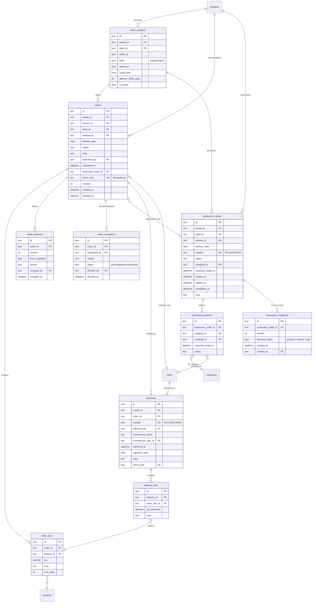
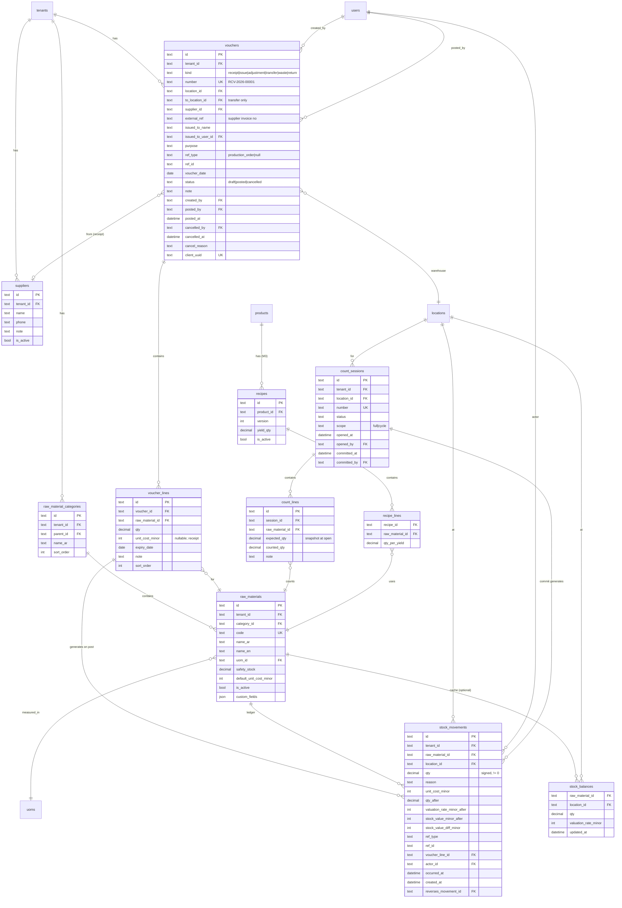
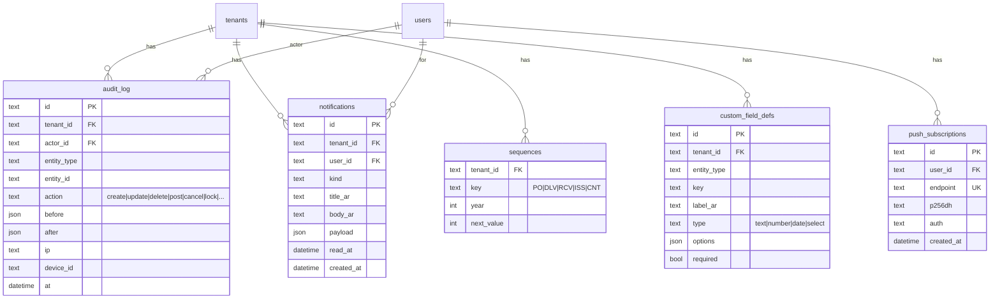

# مخطط الكيانات والعلاقات (ERD)

> يُعرض بـ Mermaid. يُفتح في GitHub مباشرة أو أي عارض Mermaid.

## 1. المنصة والكتالوج

```mermaid
erDiagram
    tenants ||--o{ tenant_settings : has
    tenants ||--o| tenant_branding : has
    tenants ||--o{ users : has
    tenants ||--o{ locations : has
    tenants ||--o{ uoms : has
    tenants ||--o{ categories : has
    tenants ||--o{ products : has

    users ||--o{ user_roles : has
    users ||--o{ trusted_devices : has
    users ||--o{ sessions : has
    user_roles }o--o| locations : "scoped to (optional)"

    locations ||--o{ locations : "default_plant_id (branch → plant)"

    categories ||--o{ categories : parent
    categories ||--o{ products : contains
    products }o--|| uoms : measured_in
    products ||--o{ product_availability : "visible at"
    product_availability }o--|| locations : branch

    uoms ||--o{ uom_conversions : from
    uoms ||--o{ uom_conversions : to

    tenants {
        text id PK
        text name
        text slug UK
        text status
        datetime created_at
    }
    tenant_settings {
        text tenant_id PK_FK
        text timezone
        text currency_code
        int currency_decimals
        text numerals
        text valuation_method
        bool allow_negative_stock
        int week_start
        text calendar
    }
    tenant_branding {
        text tenant_id PK_FK
        text company_name
        text logo_url
        text primary_color
        text footer_text
        text phone
        text address
    }
    users {
        text id PK
        text tenant_id FK
        text email UK
        text phone
        text full_name
        text password_hash
        text pin_hash
        bool is_active
        datetime last_login_at
    }
    user_roles {
        text user_id FK
        text role
        text location_id FK "nullable"
    }
    trusted_devices {
        text id PK
        text user_id FK
        text device_fingerprint
        text label
        datetime last_seen_at
        datetime revoked_at
    }
    locations {
        text id PK
        text tenant_id FK
        text code UK
        text name_ar
        text name_en
        text kind "plant|branch|warehouse|transit"
        text default_plant_id FK
        text phone
        text address
        int sort_order
        bool is_active
    }
    uoms {
        text id PK
        text tenant_id FK
        text code
        text name_ar
        text name_en
        int decimals
    }
    uom_conversions {
        text from_uom_id FK
        text to_uom_id FK
        decimal factor
    }
    categories {
        text id PK
        text tenant_id FK
        text parent_id FK
        text name_ar
        text name_en
        text color
        text icon
        int sort_order
        bool is_active
    }
    products {
        text id PK
        text tenant_id FK
        text category_id FK
        text code UK
        text name_ar
        text name_en
        text uom_id FK
        text image_url
        int sort_order
        bool is_active
        json custom_fields
    }
    product_availability {
        text product_id FK
        text location_id FK
    }
```

## 2. الطلبيات والإنتاج والتسليم



## 3. المخزون (الدفتر)



## 4. الدعم: التدقيق، الإشعارات، المزامنة



---

## قرارات التصميم المهمة في المخطط

| القرار | السبب |
|---|---|
| **المعرّفات نصية (ULID)** لا أرقام تسلسلية | تُولَّد على الجهاز بدون اتصال، قابلة للفرز زمنياً، لا تعارض عند المزامنة |
| **`client_uuid` على كل كيان يُنشأ من الجهاز** | مفتاح Idempotency — إعادة الإرسال لا تُكرّر |
| **`number` منفصل عن `id`** | المستخدم يرى `PO-2026-00123`، النظام يستخدم ULID |
| **`sequences` جدول** | ترقيم تسلسلي لكل مستأجر/نوع/سنة بدون تعارض |
| **المبالغ `*_minor` أعداد صحيحة** | 1250 = 12.50 ريال. لا Float |
| **الكميات `decimal(18,4)`** | 4 منازل تكفي للجرام والمليلتر |
| **`qty_after`, `valuation_rate_minor_after`, `stock_value_minor_after` في كل حركة** | أي تقرير تاريخي = قراءة سطر، لا إعادة حساب |
| **`production_snapshots`** | الطباعة تعرض ما كان وقت القفل، حتى لو أُضيفت استثناءات لاحقاً |
| **`order_revisions` JSON snapshot** | تاريخ كامل للطلبية بدون تعقيد جداول |
| **`stock_balances` اختياري** | يُفعَّل فقط إن تجاوز الدفتر ملايين الصفوف. الدفتر دائماً هو الحق |
| **`reverses_movement_id`** | ربط الحركة العكسية بأصلها للتتبع |
| **`user_roles.location_id` nullable** | دور عام (admin) أو مقيّد بموقع (branch_user للفرع X) |
| **`locations.default_plant_id`** | الفرع يعرف معمله. يمكن تجاوزه عند الطلب |
| **`custom_fields` JSON + `custom_field_defs`** | حقول إضافية بدون migration |
