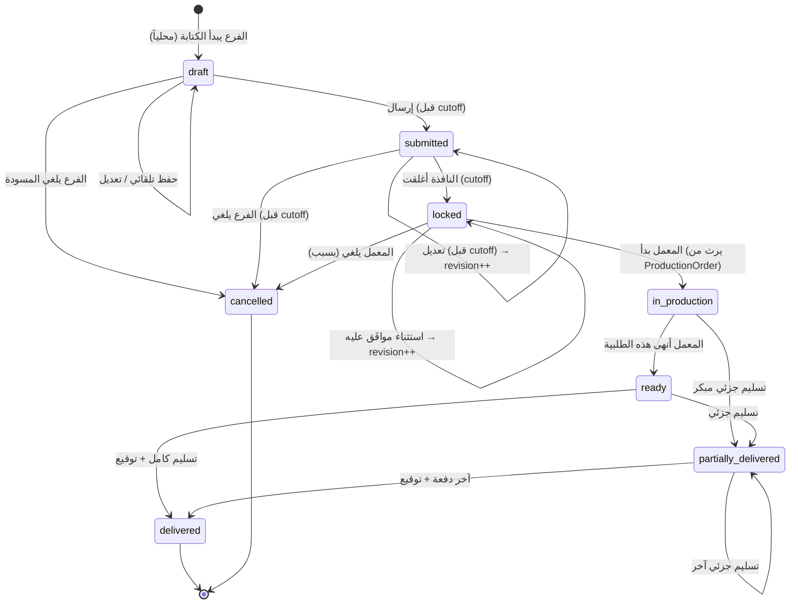
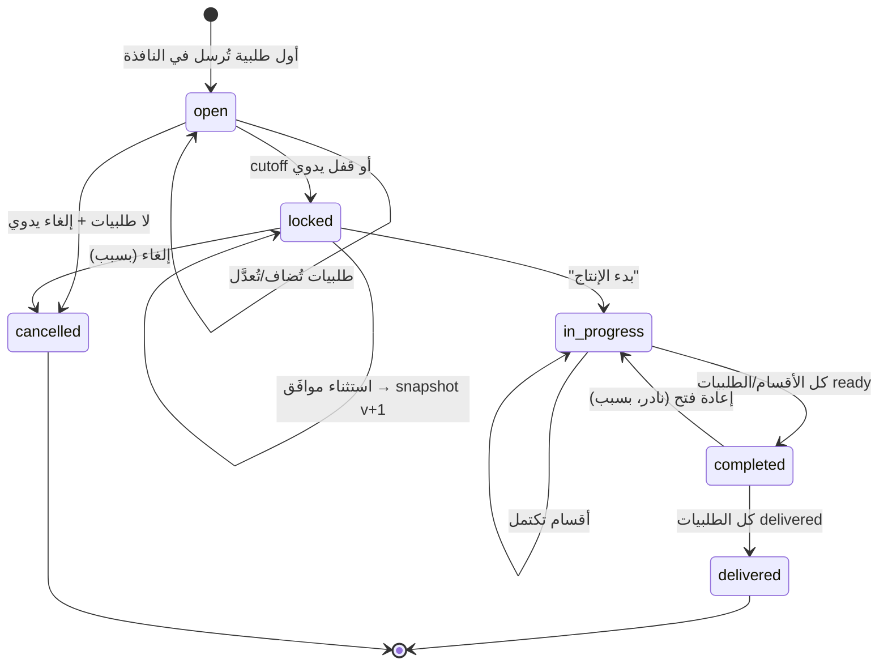
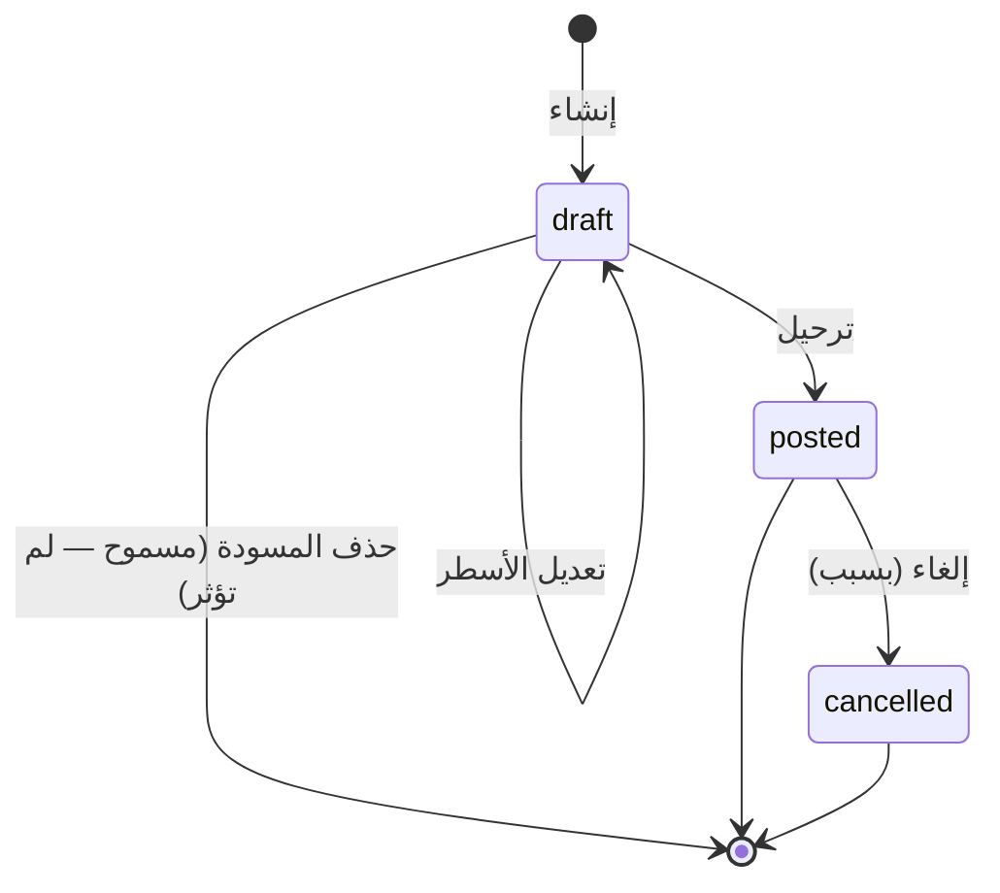
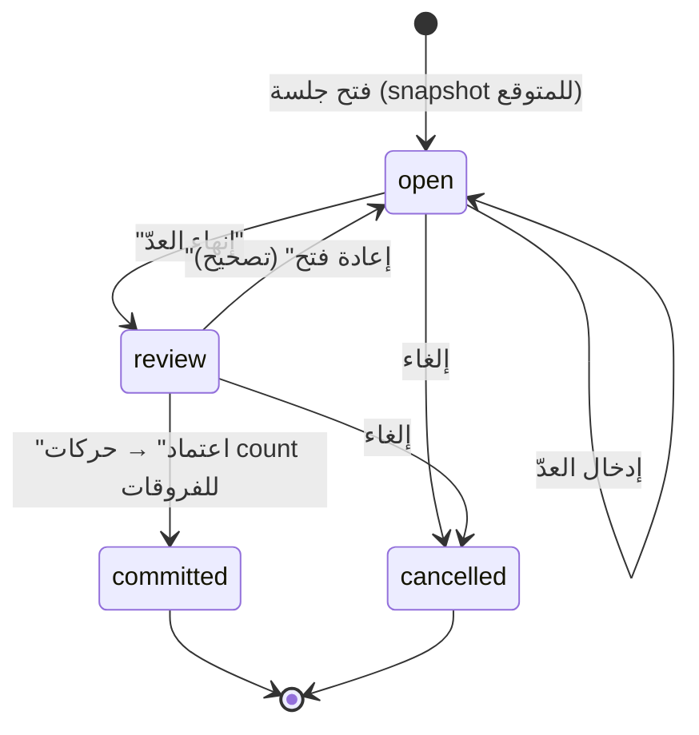
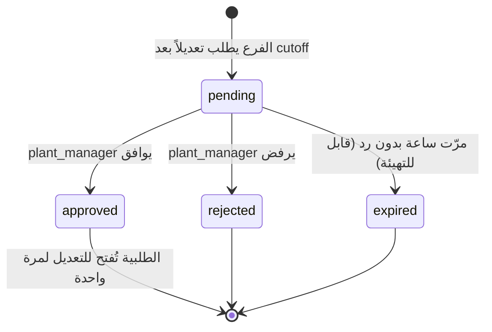

# آلات الحالة (State Machines)

> كل كيان له دورة حياة محددة. الانتقالات المسموحة فقط هي الموجودة هنا. أي انتقال آخر يُرفض على مستوى الخدمة ويُسجَّل كمحاولة في التدقيق.

---

## 1. الطلبية (Order)



### جدول الانتقالات

| من | إلى | المُحفِّز | الشرط | من يستطيع | الأثر الجانبي |
|---|---|---|---|---|---|
| — | `draft` | فتح شاشة الطلب | — | `branch_user` | يُنشأ محلياً (IndexedDB) |
| `draft` | `submitted` | زر "إرسال" | `now < window.cutoff` و `lines.length > 0` | `branch_user` | يُرسل للخادم، يُنشئ/يُحدّث `ProductionOrder`، إشعار للمعمل |
| `submitted` | `submitted` | تعديل وإرسال | `now < cutoff` | `branch_user` | `revision++`، snapshot في `order_revisions` |
| `submitted` | `locked` | Cron عند `cutoff` | — | النظام | `ProductionOrder.lock()`, snapshot، إشعار "أُغلقت النافذة" |
| `locked` | `locked` | موافقة استثناء | `OrderException.approved` | `plant_manager` | `revision++`، snapshot جديد للـ PO، تدقيق |
| `locked` | `in_production` | `ProductionOrder.start()` | — | `plant_manager` | يُطبّق على كل طلبيات الـ PO |
| `in_production` | `ready` | "جاهزة" لهذه الطلبية | — | `plant_staff` | إشعار للفرع: "طلبيتك جاهزة" |
| `ready` / `in_production` | `partially_delivered` | تسجيل تسليم | `Σ delivered < Σ ordered` لأي سطر | `plant_staff` | `Delivery` جديدة |
| `ready` / `partially_delivered` | `delivered` | تسجيل تسليم | `Σ delivered ≥ Σ ordered` لكل سطر | `plant_staff` | `Delivery` + توقيع، إشعار للفرع، إن كانت آخر طلبية → `PO.delivered` |
| أي | `cancelled` | إلغاء | يحتاج سبب | حسب المرحلة | تدقيق، إشعار للطرف الآخر |

### ما لا يمكن أبداً
- `draft → locked` (يجب أن تُرسل أولاً)
- `delivered → أي شيء` (نهائية)
- `cancelled → أي شيء` (نهائية)
- تعديل `order_lines` بعد `locked` بدون `OrderException`

---

## 2. أمر الإنتاج (ProductionOrder)



### القواعد
- **الإنشاء تلقائي:** لا أحد "يُنشئ" أمر إنتاج. يظهر عند أول `OrderSubmitted` لـ `(plant, window, date)`.
- **القفل تلقائي أو يدوي:** Cron عند `cutoff`، أو `plant_manager` يقفل مبكراً ("كل الفروع أرسلت، لا داعي للانتظار").
- **Snapshot عند القفل:** `production_snapshots.v1` = المصفوفة الكاملة. الطباعة تستخدم آخر snapshot.
- **`assigned_to` و`expected_ready_at`:** تُعيَّن في `locked` أو `in_progress`. تظهر في الطباعة وللفروع.
- **الأقسام (Sections):** اختيارية. إن استُخدمت، كل قسم له حالته ومسؤوله. `PO.completed` عندما كل الأقسام `completed`.

---

## 3. السند (Voucher)



### الترحيل (`post`) — العملية الأهم في المخزون

```
BEGIN TRANSACTION
  FOR EACH line IN voucher.lines (ORDER BY sort_order):
    balance = SELECT qty, valuation_rate FROM ledger WHERE material, location ORDER BY occurred_at DESC, created_at DESC LIMIT 1
    
    IF voucher.kind IN ('issue', 'waste', 'transfer-out'):
      signed_qty = -line.qty
      IF NOT settings.allow_negative_stock AND balance.qty + signed_qty < 0:
        ROLLBACK; RAISE "رصيد غير كافٍ للمادة X: المتاح N"
      unit_cost = balance.valuation_rate          -- الصادر بالمتوسط الحالي
      new_rate  = balance.valuation_rate          -- لا يتغير
    
    ELSE IF voucher.kind IN ('receipt', 'return-in', 'transfer-in', 'opening'):
      signed_qty = +line.qty
      unit_cost  = line.unit_cost ?? material.default_unit_cost ?? balance.valuation_rate
      IF balance.qty <= 0:
        -- منطق SAP: الرصيد صفر أو سالب → المتوسط الجديد = سعر الوارد
        new_rate = unit_cost
      ELSE:
        new_rate = ROUND((balance.qty × balance.valuation_rate + line.qty × unit_cost) / (balance.qty + line.qty), 4)
    
    ELSE IF voucher.kind = 'adjustment':
      signed_qty = line.qty  -- مُوقَّع من المستخدم
      unit_cost  = balance.valuation_rate
      new_rate   = balance.valuation_rate
    
    qty_after   = balance.qty + signed_qty
    value_after = ROUND(qty_after × new_rate)
    value_diff  = value_after - balance.stock_value
    
    INSERT INTO stock_movements (..., qty=signed_qty, unit_cost, qty_after, valuation_rate_after=new_rate, stock_value_after=value_after, stock_value_diff=value_diff, actor=current_user, occurred_at=voucher.date, ref_type='voucher', ref_id=voucher.id, voucher_line_id=line.id)
    
    IF qty_after < material.safety_stock AND balance.qty >= material.safety_stock:
      EMIT StockBelowSafety(material, location, qty_after)
  
  UPDATE vouchers SET status='posted', posted_by, posted_at
  INSERT INTO audit_log (...)
COMMIT
```

**التحويل (`transfer`):** سند واحد يولّد زوج حركات لكل سطر: `-qty` في `location_id` و`+qty` في `to_location_id`، بنفس `unit_cost` (التحويل لا يغيّر التكلفة).

### الإلغاء (`cancel`)
```
BEGIN TRANSACTION
  FOR EACH movement WHERE ref_id = voucher.id:
    INSERT reversal movement: qty = -movement.qty, reason='reversal', reverses_movement_id=movement.id, unit_cost=movement.unit_cost
    -- إعادة حساب المتوسط للعكس تتبع نفس منطق post بالإشارة المعاكسة
  UPDATE vouchers SET status='cancelled', cancelled_by, cancelled_at, cancel_reason
  INSERT INTO audit_log
COMMIT
```
**ملاحظة:** إلغاء سند قديم بعده حركات كثيرة قد يُنتج متوسطاً مختلفاً قليلاً عمّا لو لم يُسجَّل أصلاً. هذا **مقبول ومعروف** في كل أنظمة المتوسط المتحرك (ERPNext يعيد الحساب في الخلفية؛ نحن نكتفي بالعكس ونوثّق). إن أراد العميل الدقة المطلقة بأثر رجعي → FIFO في إصدار لاحق.

---

## 4. جلسة الجرد (CountSession)



### القواعد
- **عند `open`:** لكل مادة في النطاق (`full` = كل المواد، `cycle` = مواد مختارة)، يُلتقط `expected_qty = current balance` **في تلك اللحظة**.
- **أثناء `open`:** حركات أخرى قد تحدث. **لا نُحدّث `expected_qty`** — الفرق يُقاس ضد لحظة الفتح. (هذا هو التصميم الصحيح وفق البحث؛ تحديثه يجعل الفرق بلا معنى.)
- **عند `committed`:** لكل سطر `counted_qty ≠ expected_qty` → حركة `count` بـ `qty = counted - expected`. السطور المتساوية لا تولّد شيئاً.
- **بعد `committed`:** الجلسة للقراءة فقط (Trigger).
- **تحذير في الواجهة:** إن حدثت حركات على مادة بين `open` و`commit`، نعرض تنبيهاً "حدثت 3 حركات على هذه المادة أثناء الجرد" ليقرر المستخدم.

---

## 5. طلب الاستثناء (OrderException)



---

## 6. التسليم (Delivery) — لا آلة حالة

التسليم **حدث** لا كيان بحالات. يُنشأ مرة واحدة بكل بياناته (من، لمن، متى، ماذا، توقيع). بعد الإنشاء غير قابل للتعديل. الخطأ يُصحَّح بـ:
- تسليم إضافي (إن كان النقص)
- `Return` (إن كانت الزيادة أو التلف) — M2

---

## التنفيذ في الكود

كل آلة حالة تُنفَّذ كدالة نقية:

```ts
// ordering/domain/order-state.ts
type OrderStatus = 'draft' | 'submitted' | 'locked' | 'in_production' | 'ready' | 'partially_delivered' | 'delivered' | 'cancelled';
type OrderEvent = 'submit' | 'lock' | 'approve_exception' | 'start' | 'mark_ready' | 'deliver_partial' | 'deliver_full' | 'cancel';

const TRANSITIONS: Record<OrderStatus, Partial<Record<OrderEvent, OrderStatus>>> = {
  draft:               { submit: 'submitted', cancel: 'cancelled' },
  submitted:           { submit: 'submitted', lock: 'locked', cancel: 'cancelled' },
  locked:              { approve_exception: 'locked', start: 'in_production', cancel: 'cancelled' },
  in_production:       { mark_ready: 'ready', deliver_partial: 'partially_delivered', cancel: 'cancelled' },
  ready:               { deliver_partial: 'partially_delivered', deliver_full: 'delivered' },
  partially_delivered: { deliver_partial: 'partially_delivered', deliver_full: 'delivered' },
  delivered:           {},
  cancelled:           {},
};

export function transition(current: OrderStatus, event: OrderEvent): Result<OrderStatus, InvalidTransition> {
  const next = TRANSITIONS[current][event];
  return next ? ok(next) : err(new InvalidTransition(current, event));
}
```

الاختبارات تغطي **كل خلية** في الجدول (المسموح والممنوع).
